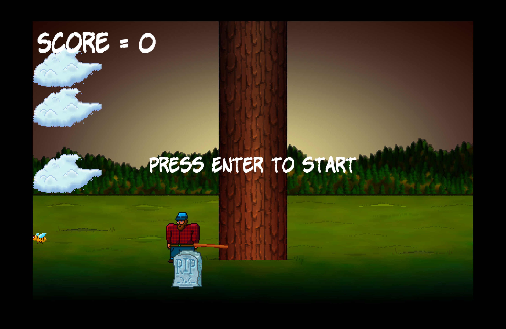
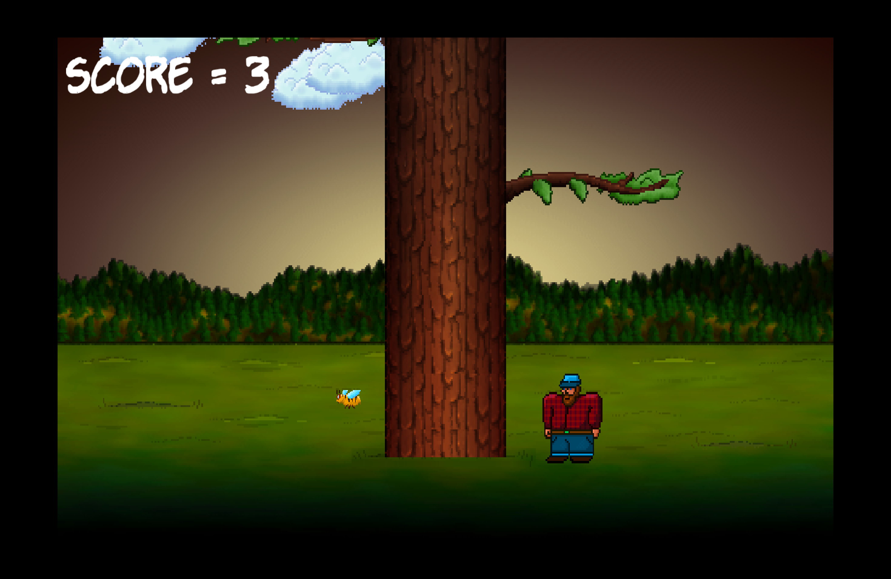

<<<<<<< HEAD
# timberman-sfml-game
=======
# 🌲 Timber - SFML Lumberjack Game


A fast-paced **2D lumberjack arcade game** built using **C++** and **SFML (Simple and Fast Multimedia Library)**.

The goal is simple: **chop the tree quickly, avoid branches, and survive as long as possible.**

---

# 🎮 Gameplay Screenshots





---

# 📂 Project Structure

```
Timber-SFML-Game/
│
├── main.cpp
│
├── textures/
│   ├── background.png
│   ├── bee.png
│   ├── cloud.png
│   ├── tree.png
│   ├── branch.png
│   ├── rip.png
│   ├── player.png
│   ├── axe.png
│   └── log.png
│
├── sound/
│   ├── chop.wav
│   ├── death.wav
│   └── out_of_time.wav
│
├── font/
│   └── KOMIKAP_.ttf
│
├── screenshot/
│   ├── gameplay1.png
│   └── gameplay2.png
│
└── README.md
```

⚠️ The **textures**, **sound**, and **font** folders must exist in the same directory as the executable.

---

# 🚀 Build and Run

## 🍎 macOS

### Install Dependencies

```bash
brew install sfml@2
```

### Compile

```bash
g++ main.cpp \
-I/opt/homebrew/Cellar/sfml@2/2.6.2_1/include \
-L/opt/homebrew/Cellar/sfml@2/2.6.2_1/lib \
-lsfml-graphics -lsfml-window -lsfml-system -lsfml-audio \
-o main
```

### Run

```bash
./main
```

---

## 🐧 Linux (Ubuntu / Debian)

### Install Dependencies

```bash
sudo apt update
sudo apt install libsfml-dev
```

### Compile

```bash
g++ main.cpp -o main -lsfml-graphics -lsfml-window -lsfml-system -lsfml-audio
```

### Run

```bash
./main
```

---

## 🪟 Windows (MinGW / GCC)

### Setup

1. Download the **MinGW version of SFML**
2. Extract it to:

```
C:\SFML
```

### Compile

```bash
g++ main.cpp -I"C:\SFML\include" -L"C:\SFML\lib" -lsfml-graphics -lsfml-window -lsfml-system -lsfml-audio -o main.exe
```

### Copy DLL Files

Go to:

```
C:\SFML\bin
```

Copy all `.dll` files and paste them into the folder containing **main.exe**.

### Run

```
.\main.exe
```

---

# 🎮 Controls

| Key         | Action              |
| ----------- | ------------------- |
| Enter       | Start Game          |
| Left Arrow  | Chop from the left  |
| Right Arrow | Chop from the right |
| Escape      | Quit Game           |

---

# 🛠 Built With

* **C++**
* **SFML 2.6**
* **GCC / g++**

---

# 📌 Future Improvements

* Add game menu
* Add score leaderboard
* Add improved animations
* Add sound settings

---
>>>>>>> 08aa158 (first commit)
